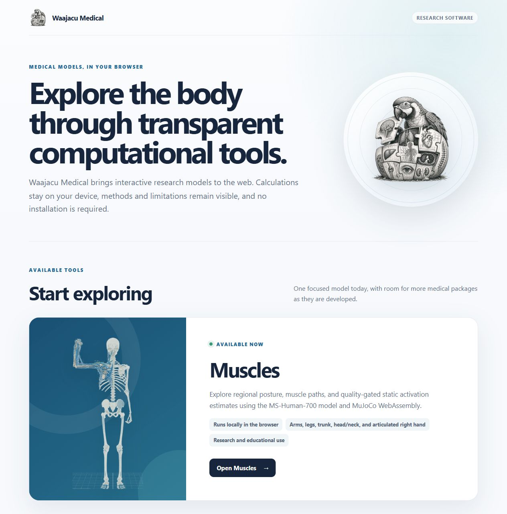
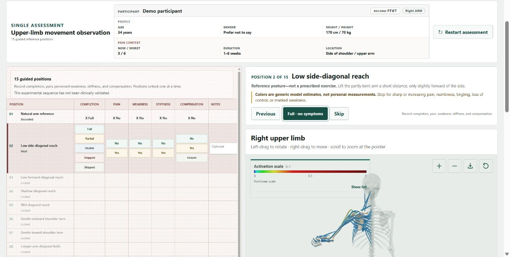

# Waajacu Medical

Waajacu Medical is a collection of browser-based research and educational
tools. The repository is organized as a monorepo so each tool can keep its own
source, verification, and licensing boundary while sharing one public catalog.

## Screenshots

### Medical catalog

<a href="https://medical.waajacu.com/">
  
</a>

### Muscles assessment

<a href="https://medical.waajacu.com/en/tools/muscles/">
  
</a>

## Published routes

- `/` - catalog of available medical tools
- `/en/tools/muscles/` - MS-Human-700 musculoskeletal explorer
- `/muscles/` - compatibility redirect to the canonical Muscles route

The public site is assembled by `.github/workflows/pages.yml`. Only `site/`,
the catalog logo, and each explicitly selected tool's static distribution are
included in the GitHub Pages artifact. Development files and `tmp/` are never
published.

## Tools

### Muscles

The source is in `muscles/`. Its browser distribution is `muscles/public/`,
and its independent verification command is:

```powershell
powershell.exe -NoProfile -ExecutionPolicy Bypass -File .\muscles\release.ps1
```

The application runs locally in the browser. It is research and educational
software, not a medical device.
